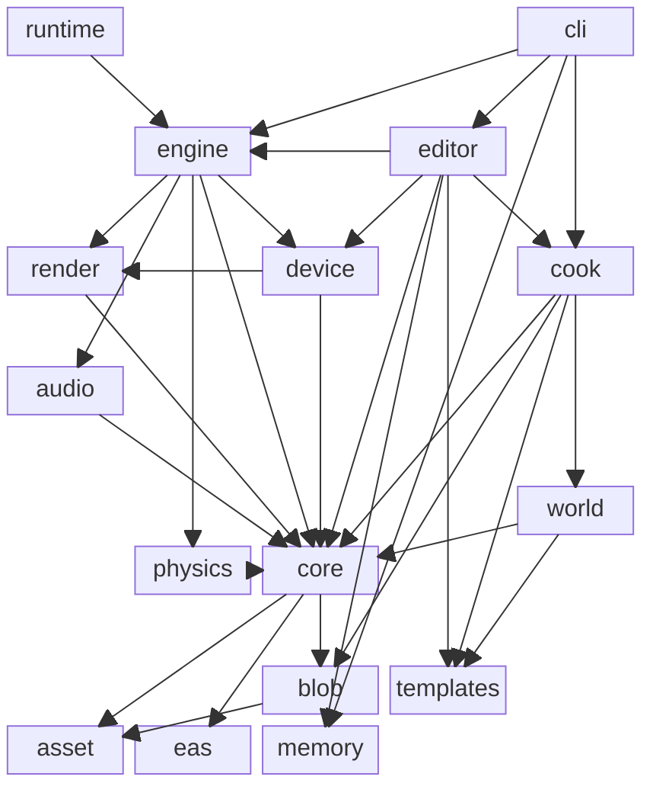

# Crates

| Crate                  | Kind      |      no_std?       | Role                                                                |
| ---------------------- | --------- | :----------------: | ------------------------------------------------------------------- |
| `concinnity-cli`       | bin       |                    | `concinnity` executable: build, run, add, export, debug.            |
| `concinnity-runtime`   | bin       |                    | Standalone runtime player for a cooked world.                       |
| `concinnity-editor`    | lib       |                    | In-engine world editor: live preview, draggable panels, hot-reload. |
| `concinnity-cook`      | lib       |                    | Asset cook pipeline that bakes an authored world into a blob.       |
| `concinnity-world`     | lib       |                    | Authored world source, args schema, and validation.                 |
| `concinnity-engine`    | lib       |                    | Runtime engine: ECS schedule and graphics/spawn/streaming systems.  |
| `concinnity-device`    | lib       |                    | GPU backends (Metal/Vulkan/DX) behind a device facade.              |
| `concinnity-render`    | lib       |                    | GPU-free render preparation.                                        |
| `concinnity-physics`   | lib       |                    | Physics system (rapier3d).                                          |
| `concinnity-audio`     | lib       |                    | Audio system (kira).                                                |
| `concinnity-core`      | lib       |                    | Shared ECS, assets, resources, and math foundation.                 |
| `concinnity-blob`      | lib       | :white_check_mark: | Packed asset blob format; `write` feature gated to cook.            |
| `concinnity-asset`     | lib       | :white_check_mark: | User-facing asset schema (the single home for asset types).         |
| `concinnity-eas`       | lib       | :white_check_mark: | Entity/archetype storage backing the ECS.                           |
| `concinnity-templates` | lib       | :white_check_mark: | Typed asset/world spec builders and starter templates.              |
| `concinnity-memory`    | lib       | :white_check_mark: | Tracking global allocator and heap stats.                           |
| `concinnity-toolchain` | build-dep |                    | Build-time codegen for the binary and graphics crates.              |
| `concinnity-docs`      | build-dep |                    | Build-time asset-doc generator (reads `concinnity-world`).          |

## Linkage

