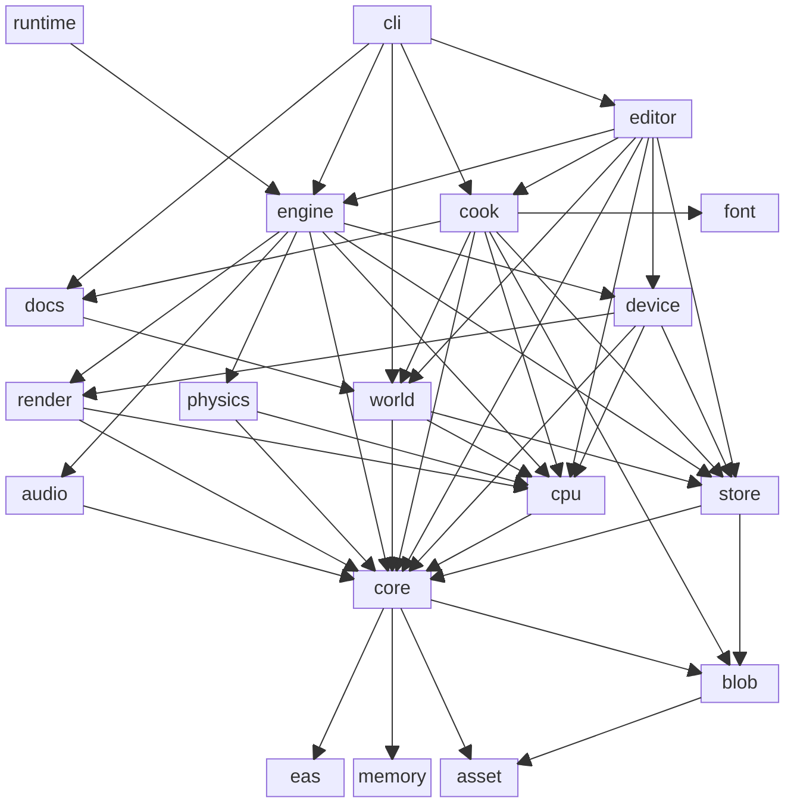

# Crates

| Crate                  | Kind      |      no_std?       | Role                                                                 |
| ---------------------- | --------- | :----------------: | -------------------------------------------------------------------- |
| `concinnity-cli`       | bin       |                    | `concinnity` executable: build, run, add, export, debug.             |
| `concinnity-runtime`   | bin       |                    | Standalone runtime player for a cooked world.                        |
| `concinnity-editor`    | lib       |                    | In-engine world editor: live preview, draggable panels, hot-reload.  |
| `concinnity-cook`      | lib       |                    | Asset cook pipeline that bakes an authored world into a blob.        |
| `concinnity-world`     | lib       |                    | Authored world source, args schema, validation, and spec builders.   |
| `concinnity-engine`    | lib       |                    | Runtime engine: ECS schedule, graphics/spawn/streaming, allocator.   |
| `concinnity-device`    | lib       |                    | GPU backends (Metal/Vulkan/DX) behind a device facade.               |
| `concinnity-shader`    | lib       |                    | Build-time shader compilers for the backend being built.             |
| `concinnity-font`      | lib       |                    | Build-time glyph atlas rasteriser for cook and the engine binary.    |
| `concinnity-render`    | lib       |                    | GPU-free render preparation.                                         |
| `concinnity-physics`   | lib       |                    | Physics system (wraps [rapier3d]).                                   |
| `concinnity-audio`     | lib       |                    | Audio system (wraps [kira]).                                         |
| `concinnity-store`     | lib       |                    | State tree on disk: paths, source lookup, blob reads.                |
| `concinnity-cpu`       | lib       |                    | CPU compute over the vocabulary: payload codecs, geometry, kernels.  |
| `concinnity-core`      | lib       | :white_check_mark: | Runtime vocabulary: GPU layouts, ECS components, world data, settings. |
| `concinnity-blob`      | lib       | :white_check_mark: | Packed asset blob format; `write` feature gated to cook.             |
| `concinnity-asset`     | lib       | :white_check_mark: | User-facing asset schema (the single home for asset types).          |
| `concinnity-eas`       | lib       | :white_check_mark: | Entity/archetype storage backing the ECS.                            |
| `concinnity-memory`    | lib       | :white_check_mark: | Allocation layer: tracking allocator, tagged budgets, arenas, pools. |
| `concinnity-docs`      | lib       | :white_check_mark: | Asset reference, extracted at build time and embedded.               |
| `concinnity-toolchain` | build-dep |                    | Build-script support: cfgs, SDKs, source hashing, doc extraction.    |

[kira]: https://docs.rs/kira/latest/kira
[rapier3d]: https://docs.rs/rapier3d/latest/rapier3d

## Linkage

