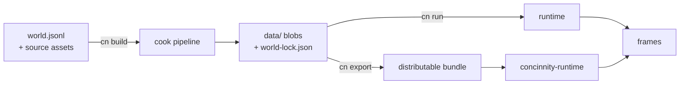
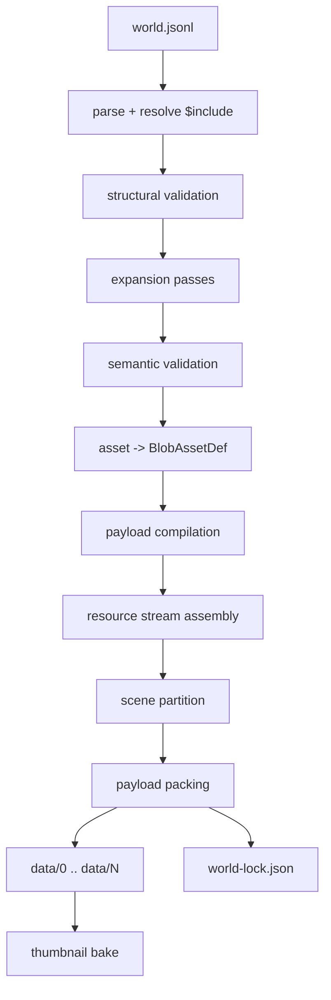
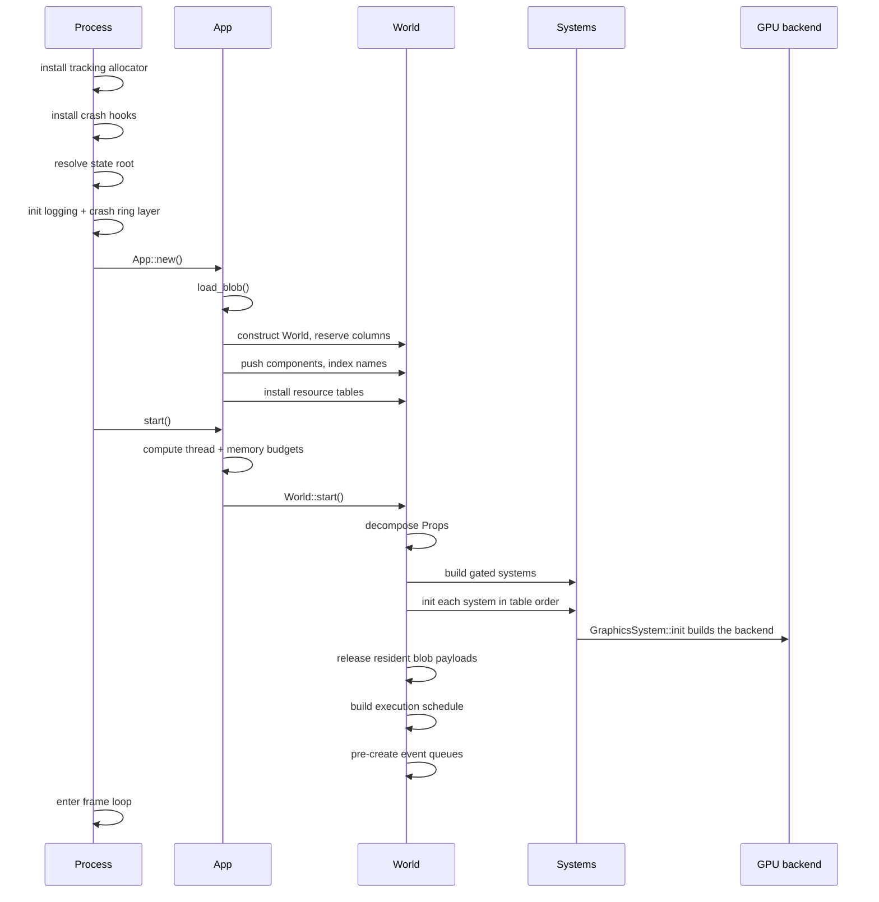
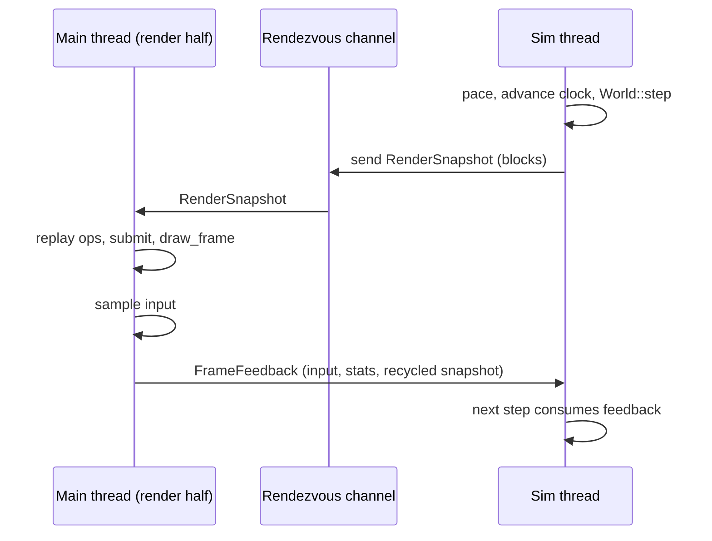
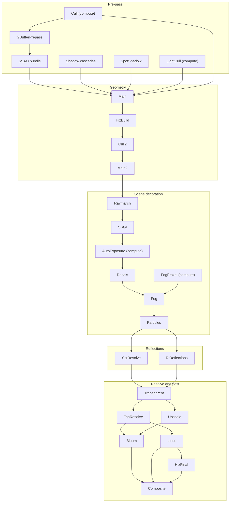

# Technical Specification

This document specifies how Concinnity works at the level of mechanism: the
process lifecycle, the data formats, the execution model, and the contracts
between subsystems. It is the reference for someone who needs to reason about
_why_ the engine behaves the way it does, or who is changing engine internals.

It deliberately does **not** enumerate asset types or their fields. That is the
[asset reference](../assets/index.md), which is generated from the schema and is
always current. This document describes the machinery those assets flow through.

**Status.** The engine is pre-1.0. Formats described here are regenerated by
every cook and carry no backward-compatibility guarantee. Where a mechanism is
implemented on some rendering backends and not others, that is stated inline.

## Contents

1. [Design principles](#1-design-principles)
2. [System architecture](#2-system-architecture)
3. [Data model](#3-data-model)
4. [Authoring format](#4-authoring-format)
5. [Cook pipeline](#5-cook-pipeline)
6. [Blob container format](#6-blob-container-format)
7. [State tree on disk](#7-state-tree-on-disk)
8. [Start-up sequence](#8-start-up-sequence)
9. [Runtime execution model](#9-runtime-execution-model)
10. [Frame rendering](#10-frame-rendering)
11. [Streaming and residency](#11-streaming-and-residency)
12. [Memory management](#12-memory-management)
13. [Concurrency model](#13-concurrency-model)
14. [Error handling](#14-error-handling)
15. [Diagnostics](#15-diagnostics)
16. [Settings and persistence](#16-settings-and-persistence)
17. [Distribution](#17-distribution)
18. [Appendix A: render pass catalogue](#appendix-a-render-pass-catalogue)
19. [Appendix B: glossary](#appendix-b-glossary)

---

## 1. Design principles

These constraints explain most of the structure that follows.

**Asset-driven, not script-driven.** A world is a set of declarative assets.
There is no embedded scripting language and no user-supplied bytecode. Runtime
behaviour emerges from asset composition: a `Behavior` asset is a compiled tree
of typed nodes over typed state, not a program the engine interprets from
source. The practical consequence is that the entire runtime surface is knowable
at cook time, which is what makes validation, gating, and ahead-of-time
compilation possible.

**Cook once, play many.** Everything expensive happens in the cook: source
imports, mesh compilation, texture encoding, shader compilation, IBL
convolution, font rasterisation. The runtime loads compiled payloads and
uploads them. No asset compiler ships in the player.

**Closed-world storage.** The set of component types is fixed at compile time by
a single registry macro. There is no `TypeId`-keyed type erasure and no
open-world insertion of arbitrary types. This buys dense storage, a bitmask
scheduler, and exhaustive dispatch.

**Gated systems.** No world declares a system. Each internal system has a _gate_
that inspects world content and returns a constructed system or nothing. A world
with no audio content opens no audio device; a world with no physics content
builds no physics simulation.

**One-way dependency graph.** Crates form a DAG with no cycles and no
back-edges. The runtime vocabulary knows nothing about file paths; the format
crate knows nothing about I/O; the cook crates are never linked into a shipped
player.

**Proprietary code stays behind a facade.** Metal, DirectX 12, and Vulkan live
in one crate behind one trait. Exactly one compiles per build. Nothing above
that boundary names a concrete backend type.

**Untrusted input is decoded defensively.** Compiled payloads and artist-supplied
source files are bytes the process did not produce. Their decoders use
bounds-checked readers and checked size arithmetic, so a truncated or hostile
file is an error, not a panic or an out-of-bounds read.

---

## 2. System architecture

### 2.1 Crate topology

The workspace is split so that each crate's dependencies match its job. The two
properties that matter most: `no_std` crates carry the runtime vocabulary and
can be consumed by a minimal client, and the cook-only crates
(`cook`, `world`, `shader`, `font`, `docs`) are never linked into a shipped
player.

| Crate                  | Kind      | `no_std` | Role                                                      |
| ---------------------- | --------- | :------: | --------------------------------------------------------- |
| `concinnity-cli`       | bin       |          | The `concinnity` developer executable.                    |
| `concinnity-runtime`   | bin       |          | Standalone player for a cooked world.                     |
| `concinnity-editor`    | lib       |          | In-engine world editor, live preview, hot reload.         |
| `concinnity-cook`      | lib       |          | Asset compile pipeline: authored world to blob.           |
| `concinnity-world`     | lib       |          | Authored world model, schema, validation, spec builders.  |
| `concinnity-engine`    | lib       |          | Runtime engine: schedule, systems, app loop, allocator.   |
| `concinnity-device`    | lib       |          | GPU backends behind a device facade.                      |
| `concinnity-shader`    | lib       |          | Cook-time shader compilers for the target backend.        |
| `concinnity-font`      | lib       |          | Cook-time glyph atlas rasteriser.                         |
| `concinnity-render`    | lib       |          | GPU-free render preparation and the backend trait.        |
| `concinnity-physics`   | lib       |          | Simulation driver: world content to bodies and back.      |
| `concinnity-audio`     | lib       |          | Audio mixing and spatialisation facade.                   |
| `concinnity-store`     | lib       |          | On-disk state tree: paths, source lookup, blob reads.     |
| `concinnity-cpu`       | lib       |          | CPU compute: payload codecs, geometry, kernels, job pool. |
| `concinnity-core`      | lib       |   yes    | Runtime vocabulary: GPU layouts, ECS storage and components, world data, blob format. |
| `concinnity-asset`     | lib       |   yes    | User-facing asset schema (data only).                     |
| `concinnity-memory`    | lib       |   yes    | Tracking allocator, tagged budgets, arenas, pools.        |
| `concinnity-dynamics`  | lib       |   yes    | Rigid-body simulation: bodies, contacts, solver, queries. |
| `concinnity-docs`      | lib       |   yes    | Asset reference, extracted at compile time.               |
| `concinnity-toolchain` | build-dep |          | Build-script support: cfgs, SDKs, source hashing, docs.   |

- `concinnity-asset` holds **data only**. No behaviour, one dependency (serde).
- `concinnity-core` may not name a path, a file, or an I/O type.
- The `World` is split across that line: `concinnity-core` owns its data half
  (components, resources, events, payload store, profile, frame scratch) and
  `concinnity-engine` wraps that in the half that runs (the constructed systems,
  their schedule, `start` and `step`). Building world content therefore needs no
  operating system, which is what the facade's `--no-default-features` tier is.
- `concinnity_core::blob` performs no I/O and holds no residency policy.
- `concinnity-cook` never appears in the runtime's dependency closure.
- The cook itself carries no backend cfgs, so it runs on hosts with no GPU.
- `concinnity-device` depends on `concinnity-render`, never the reverse.

### 2.2 Binaries

| Binary               | Purpose                                                                                                                      |
| -------------------- | ---------------------------------------------------------------------------------------------------------------------------- |
| `concinnity`         | Developer CLI: `init`, `new`, `build`, `run`, `debug`, `editor`, `add`, `rm`, `list`, `explain`, `test`, `export`, `docs`.   |
| `concinnity-runtime` | Shipped player. Loads compiled blobs relative to its own executable and plays them. No debug server, no compiler, no editor. |

`concinnity run` and `concinnity-runtime` drive the same engine loop. The
difference is where the state root is anchored and how a missing world is
reported. `concinnity debug` compiles a world in memory and stands up a
localhost inspection channel; `concinnity editor` overlays the in-engine editor
on compiled blobs. Neither of those paths exists in a shipped player.

### 2.3 Execution phases



---

## 3. Data model

### 3.1 Assets, components, and resources

Three vocabularies exist and are easy to confuse:

**Asset** — what an author declares in `world.jsonl`. A named, typed JSON
object. This is the public schema.

**Component** — the runtime form of an asset that lives on an entity. Every
component type is registered once, in a single macro list, paired with a stable
`u8` discriminant assigned by list position. That discriminant is the blob tag
and the in-memory `ComponentId`. It is _not_ a stable on-disk contract:
reordering the list changes every tag, which is safe only because a cook
regenerates the blob.

**Resource asset** — a compiled artifact addressed by a dense per-kind handle
rather than by entity: meshes, textures, materials, fonts, audio clips, cubemaps,
environment maps, colour LUTs, skinned meshes. These live in the blob's resource
stream and are installed at load into per-kind tables the systems index by
handle.

The discriminant space is bounded at 128 by the component bitmask width. The
registry list is far shorter, so position keeps every tag in range.

Some registered components are marked `runtime` (never authored, produced by a
system: `SkeletonPose`, `FrameInput`) or `build_only` (an authoring macro that
expands away during the cook and never reaches the blob: `LightRig`, `Prefab`,
`CameraShot`, `MaterialPalette`).

### 3.2 Identity

| Type                               | Meaning                                                                                            |
| ---------------------------------- | -------------------------------------------------------------------------------------------------- |
| `AssetId`                          | Interned name. The cook interns every authored name into a dense `u32`; the runtime never interns. |
| `AssetRef<T>`                      | A typed reference to another asset by name, resolved during the cook.                              |
| `MeshHandle`, `TextureHandle`, ... | Dense index into the matching per-kind resource table.                                             |
| `Entity`                           | Generational id minted by the entity allocator when a component row is pushed.                     |
| `PayloadLocator`                   | `{ blob_index: u32, offset: u64, len: u64 }` — where a compiled payload lives.                     |

Names exist for authoring and for diagnostics. By the time a frame is drawn,
every reference is a dense integer.

### 3.3 Entity storage

`concinnity_core::ecs` holds the storage mechanism alongside the registry that
feeds it. The mechanism half provides generic primitives only: it knows nothing
about meshes, blobs, or rendering. The concrete component set arrives from the
registry (`ecs::registry`), which expands `define_components!` over the
component list; that macro in turn expands `define_component_storage!` for the
storage half. Nothing in the mechanism names a component type.

Storage is one `Column<T>` per registered component type. A column bundles:

- the component data, as a dense `Vec<T>`;
- a row-aligned `Entity` id per row;
- a row-aligned change tick per row;
- column-level tick stamps.

```
Column<Transform>
  data      [ T0 ][ T1 ][ T2 ][ T3 ]
  entities  [ e7 ][ e2 ][ e9 ][ e4 ]
  ticks     [ 41 ][ 41 ][ 58 ][ 12 ]
  stamps    { changed, added, bulk, structural }
```

**Change detection.** Four column-level stamps carry different meanings:

| Stamp        | Set when                                                                  |
| ------------ | ------------------------------------------------------------------------- |
| `changed`    | Any write of any kind. Drives whole-column change detection.              |
| `added`      | The last row was appended.                                                |
| `bulk`       | Whole-column mutable access was taken; every row must be assumed written. |
| `structural` | A row was added or removed; row positions and membership moved.           |

A consumer that tracks individual rows reads `bulk` and `structural` to decide
whether its per-row stamps still describe reality. Ticks are `u32` and are pulled
forward when they fall more than `MAX_CHANGE_AGE` (`u32::MAX / 2`) behind, so
wraparound never makes a stale row look fresh.

**Join index.** A side table maps entity id to that entity's row in each column,
maintained by every structural edit. The hazard it must respect: a swap-remove
moves the column's last row into the freed slot, so the moved row's owner needs
its recorded row patched, or a later join probe reads the wrong row.

**Resources** are singleton values keyed by type, used for per-frame protocol
between systems (see [9.4](#94-inter-system-protocol)).

**Events** are double-buffered queues with per-reader cursors. An event stays
readable for two update cycles, so every reader that runs after the writer sees
it, and each reader sees each event exactly once. This is what makes several
system couplings order-robust rather than order-critical.

---

## 4. Authoring format

### 4.1 world.jsonl

A world is a JSONL file: one JSON object per line, each declaring one asset.

```json
{"name":"gfx","type":"GraphicsConfig","args":{"clear_color":[0.5,0.75,1.0,1.0],"shadow_map_size":2048}}
{"name":"main_camera","type":"Camera3D","args":{"fov_y_degrees":75.0,"position":[0.0,4.0,22.0]}}
{"name":"tex_stone","type":"Texture","args":{"generator":"stone","resolution":256}}
{"name":"mat_stone","type":"Material","args":{"albedo":"tex_stone","roughness":0.88}}
```

Three fields:

| Field  | Required | Meaning                                                                      |
| ------ | :------: | ---------------------------------------------------------------------------- |
| `name` |   yes    | Unique identifier within the world. Becomes the interned `AssetId`.          |
| `type` |   yes    | Registered asset type name.                                                  |
| `args` |    no    | The asset's public JSON schema. Missing fields take their declared defaults. |

Line-oriented JSON is deliberate: it diffs cleanly, appends cheaply, and makes
tooling (`cn add`, `cn rm`, the editor's save-back) a line edit rather than a
document rewrite.

### 4.2 Includes

A line may be a directive instead of an asset:

```json
{ "$include": "worlds/lighting.json" }
```

The referenced file is read and spliced in place. An array splices all its
entries; a single object splices as one. Includes resolve before any validation,
so an included asset is indistinguishable from an inline one thereafter.

### 4.3 References

An asset refers to another by name, as a plain string. The registry records
which fields are references and what type they must resolve to, so a dangling or
mistyped reference is a cook error with the field named. References are
resolved to dense handles during the cook; no name lookup happens at runtime
except through the explicit runtime spawn-by-name path.

### 4.4 Typed authoring

`concinnity-world`'s `spec` module provides `AssetSpec` builders: a
struct-first, `no_std` vocabulary that produces the same world entries as
hand-written JSON. It exists so hosts and tools can construct worlds without
string-building JSON.

---

## 5. Cook pipeline

The **cook** turns an authored world and its source files into blobs. It has a
front half (load, expand, validate) and a back half (compile, pack, write).
`cn build` runs it.



### 5.1 Front half

**Parse and structural validation.** Every line must be valid JSON with a
`name` and a known `type`. Duplicate names are rejected. The result is a list of
untyped JSON values.

**Expansion.** A fixed, ordered sequence of passes rewrites the world. Order
matters because later passes must see what earlier passes produced:

| Order | Pass                 | Produces                                                                      |
| ----- | -------------------- | ----------------------------------------------------------------------------- |
| 1     | Scene imports        | Materials, meshes, props, a framed camera, from a `.glb` / `.fbx`.            |
| 2     | Stories              | Screens, text labels, hit regions from a Markdown story graph.                |
| 3     | Camera shots         | Camera presets applied to scenes.                                             |
| 4     | Light rigs           | Directional / point / spot light sets.                                        |
| 5     | Material palettes    | Named material groups.                                                        |
| 6     | Prefabs              | Instantiated prop templates.                                                  |
| 7     | Room textures        | Per-surface texture assignment.                                               |
| 8     | Companions (round 1) | The render marker and its window / shader stack, implied by everything above. |
| 9     | AppConfig            | World name and window title for distribution.                                 |
| 10    | Engine defaults      | Main menu, HUDs, chips, font, sky mesh, for a rendering world.                |
| 11    | Menus                | Screens, sprites, labels, hit regions, key bindings.                          |
| 12    | Option selects       | Settings rows to their primitives.                                            |
| 13    | Sliders              | Continuous settings rows to their primitives.                                 |
| 14    | Panels               | Background sprite plus title label.                                           |
| 15    | Companions (round 2) | Companions for everything rounds 9-14 added. Idempotent over round 1.         |

Two properties govern expansion:

- **Injection is visible.** Every asset the cook adds without a `world.jsonl`
  line is recorded in `world-lock.json` with its full args, so it can be copied
  into the world verbatim as an override.
- **Authored wins.** If the world declares an asset with the same name as one a
  pass would generate, the authored entry shadows it. Same name and same type is
  a patch-merge with the author's fields winning; same name and different type is
  a hard error. Shadowing is recorded in the lock file rather than being silent.

**Semantic validation.** Runs on the expanded world. Checks cross-references
resolve, singleton constraints hold, per-type validators pass, and asset
arguments are in range. Every error is collected and reported together rather
than failing at the first.

### 5.2 Back half

**Asset resolution.** Each expanded asset becomes a `BlobAssetDef`: the
serialised runtime component, its discriminant, its interned name, and a payload
locator if it has one. The asset-to-component translation happens here, so the
runtime never performs it.

**Payload compilation.** Assets that carry compiled binary data get it produced
now:

| Asset kind                | Compilation                                                                                                          |
| ------------------------- | -------------------------------------------------------------------------------------------------------------------- |
| Mesh / model              | Import (glTF, GLB, FBX, OBJ), tangent generation, LOD chain, index narrowing, optional heightfield collider trailer. |
| Skinned mesh              | Skin weights, bind pose, morph targets, LOD alternates.                                                              |
| Texture                   | Decode (PNG, TGA, DDS, KTX2, HDR), mip generation, block compression, tagged payload emit.                           |
| Cubemap / environment map | Equirect to cube projection, irradiance and prefilter convolution.                                                   |
| Colour LUT                | `.cube` parse into a 3D lookup payload.                                                                              |
| Font                      | Glyph atlas rasterisation with real metrics.                                                                         |
| Audio clip                | Decode and re-encode into the runtime clip payload.                                                                  |
| Shader                    | Backend-native compilation (see below).                                                                              |
| Voxel chunk / SDF volume  | Palette resolution, volume bake.                                                                                     |

**Shader compilation** is delegated through a registered toolchain seam. The
cook declares the seam; the binary registers the compiler for the backend it was
built for (Metal via `xcrun metal`/`metallib`, DirectX via the Windows SDK HLSL
compilers, Vulkan via `shaderc`). This is why the cook itself carries no backend
cfgs and no native GPU dependencies: it must run on cook hosts with no GPU. A
binary that cooks worlds must register a toolchain or every shader stage fails
with a clear error.

**Scene partition.** Content reachable only from one scene is grouped into that
scene's `SceneGroup`. Content shared between scenes, or used outside any scene,
belongs to no group and loads with the world. Groups are what let a multi-scene
world defer decoding and residency until a scene is pinned.

**Packing.** Payloads are appended into blob images under a size ceiling
(1 GiB by default). Payloads that do not fit spill into overflow blobs. Each
payload's final `(blob_index, offset, len)` is written back into its def or
resource record. Per-scene payloads are packed into dedicated blobs after the
global set.

**Cook cache.** Compiled payloads are memoised so an unchanged source is not
recompiled. Identity is stat-based, with a settle window that prevents a
same-tick equal-length rewrite from being served stale. A cook reports how many
payloads were reused versus compiled.

### 5.3 world-lock.json

Written beside the blobs. Provenance metadata, not part of the container format.

```json
{
  "engine_version": "0.18.13",
  "built_at": "2026-08-12T21:13:39.337773Z",
  "blobs": [
    {
      "path": ".concinnity/data/0",
      "checksum": "f4f8...",
      "payload_bytes": 42352312
    }
  ],
  "assets": [
    {
      "name": "gfx",
      "id": 0,
      "kind": "Component",
      "discriminant": 1,
      "args_hash": "6d2e...",
      "payload_blob": null
    }
  ],
  "resources": [],
  "injected": [],
  "shadowed": []
}
```

| Field            | Purpose                                                                              |
| ---------------- | ------------------------------------------------------------------------------------ |
| `engine_version` | Injected defaults come from the engine, so their content can change across versions. |
| `blobs`          | Per-blob path, SHA-256, and payload byte count.                                      |
| `assets`         | Every asset under its real name, with its interned id, discriminant, and args hash.  |
| `resources`      | Assets compiled into the resource stream rather than the def table.                  |
| `injected`       | Everything the cook added with no authored line, with full args.                     |
| `shadowed`       | Generated assets the world declared its own copy of, with the pre-merge args.        |

The recorded ids let a process that loads pre-cooked blobs without an in-process
cook (the editor booting cold) rebuild the name table exactly as the cook
interned it.

---

## 6. Blob container format

The container is `concinnity_core::blob`. The module owns the format contract
and nothing else: the record schema, the header constants, and the pure
bytes-to-metadata transforms. It performs no I/O and holds no residency policy,
which is what keeps it inside a `no_std` crate. Callers own both sides:
`concinnity-store` reads the on-disk layout, `concinnity-cook` writes what the
encoder returns.

### 6.1 Image layout

```
┌────────────────────────────────────────────────────────────────┐
│ HEADER (16 bytes, fixed)                                       │
│  0..4    magic          "CNB\0"                                │
│  4..8    schema hash    u32 LE, compatibility guard            │
│  8..16   meta_len       u64 LE, byte length of the meta block  │
├────────────────────────────────────────────────────────────────┤
│ METADATA BLOCK (meta_len bytes)                                │
│  postcard-serialised BlobMeta                                  │
├────────────────────────────────────────────────────────────────┤
│ PAYLOAD SECTION (to end of file)                               │
│  raw compiled payload bytes, addressed by PayloadLocator       │
└────────────────────────────────────────────────────────────────┘
```

The header is fixed at 16 bytes, so the payload section always begins at
`16 + meta_len`. A caller holding only the first 16 bytes can turn a payload
locator's offset into an absolute file offset without loading the image, which
is what the disk-backed streaming source relies on.

The schema hash is derived at compile time from the record schema itself. On
load, an image whose hash does not match the running binary's is rejected with a
distinct error rather than being decoded into misinterpreted bytes. Because a
cook always regenerates the blob, the blob and the engine that loads it always
agree; the check exists to catch a stale artifact, not to support migration.

### 6.2 Multiple blobs

Blob 0 is the primary blob. It always holds the full metadata block and may also
hold payload bytes for assets packed before the size ceiling. Overflow payloads
spill into blobs 1, 2, ... as needed. All blobs share the same header format;
only blob 0 carries non-empty metadata.

Parsing an overflow blob's payload section is deliberately lenient and
infallible: an image too short to hold a header, or one whose header points past
its end, yields an empty section. Overflow blobs carry no metadata and reach that
path without a magic or schema check.

### 6.3 Metadata block

```rust
struct BlobMeta {
    defs:        Vec<BlobAssetDef>,
    resources:   Vec<ResourceRecord>,
    manifest:    WorldManifest,
    scene_groups: Vec<SceneGroup>,
    mesh_bounds: Vec<MeshBoundsRecord>,
}
```

Serialisation is postcard: compact, positional, and non-self-describing. That is
correct here precisely because the blob is regenerated by every cook. (Settings,
which persist across cooks, use a self-describing format instead — see
[16](#16-settings-and-persistence).)

#### Component stream

```rust
struct BlobAssetDef {
    name:          Option<AssetId>,  // None for unnamed runtime-only assets
    kind:          AssetKind,        // Component
    discriminant:  u8,               // registry position; selects the component type
    args_bytes:    Vec<u8>,          // serialised runtime component
    payload:       Option<PayloadLocator>,
}
```

Every record is _baked_: `args_bytes` is the serialised runtime component, not
the authored args. The asset-to-component translation already ran in the cook.
The name is injected into the component at load time.

The blob carries only components. Systems are internal client code, constructed
at runtime from world content, and are never serialised.

#### Resource stream

```rust
struct ResourceRecord {
    resource_kind: u8,                    // ResourceKind discriminant
    handle:        u32,                   // dense index within that kind
    payload:       Option<PayloadLocator>,// payload resources
    data_bytes:    Vec<u8>,               // data resources
}
```

`resource_kind` selects the per-kind table; `handle` is the dense index within
that kind, equal to the record's position within its kind. Both the locator and
the inline-bytes branch are present so either shape round-trips; a given kind
uses one. Meshes, textures, and audio clips carry payloads; a baked material
carries its runtime bytes inline.

Resource kind discriminants are pinned by test, because a reorder would silently
re-key every table:

| Kind             | Value |
| ---------------- | ----- |
| `Mesh`           | 0     |
| `Texture`        | 1     |
| `Material`       | 2     |
| `Font`           | 3     |
| `AudioClip`      | 4     |
| `CubemapTexture` | 5     |
| `EnvironmentMap` | 6     |
| `ColorLut`       | 7     |
| `SkinnedMesh`    | 8     |

#### Manifest

```rust
struct WorldManifest {
    component_counts: Vec<(u8, u32)>,  // ascending, nonzero counts only
    max_blob_index:   u32,             // 0 = no overflow
}
```

A verified summary of the blob's shape, produced by the cook from the final
record streams. The runtime trusts it: the per-type counts pre-size every ECS
column before the bulk component load, so that load never reallocates mid-push,
and `max_blob_index` names the overflow files without scanning either stream.
Debug builds re-derive the manifest and assert it matches the shipped copy.

Nothing further is duplicated into the manifest. Type presence and feature flags
are a counts lookup away.

#### Scene groups

```rust
struct SceneGroup {
    scene:     AssetId,
    resources: Vec<(u8, u32)>,  // (resource_kind, handle)
    defs:      Vec<AssetId>,    // payload-carrying component defs
}
```

One scene's exclusively-owned blob content. Listed in scene declaration order.

#### Mesh bounds

```rust
struct MeshBoundsRecord {
    handle:       u32,
    min:          [f32; 3],
    max:          [f32; 3],
    vertex_count: u32,
    index_count:  u32,
}
```

A baked geometry summary keyed by mesh-source handle. It lets the runtime build
draw records (AABB) and size geometry reservations without decoding the payload.
A payload with no record decodes eagerly.

### 6.4 Payload section

The payload section is opaque to the container: a flat byte range that locators
index into. Individual payload formats are owned by their decoders and are all
tagged and length-prefixed. Examples:

| Payload              | Tag    | Shape                                                            |
| -------------------- | ------ | ---------------------------------------------------------------- |
| Texture              | `TEX2` | Format enum, dimensions, mip chain.                              |
| Skinned mesh         | `SKMV` | Vertex count, skinned vertices, then optional tagged trailers.   |
| Morph targets        | `MRPH` | Target count, per-target deltas. Trailer on a skinned payload.   |
| LOD alternates       | `LODS` | Level count, per-level index ranges. Trailer on a mesh payload.  |
| Heightfield collider | `HFLD` | Row/column counts and height samples. Trailer on a mesh payload. |

Every decoder reads through a bounds-checked cursor. Size arithmetic that could
overflow before being compared against a buffer length (a `width * height * 4`
that wraps to a small product and then passes a length check) goes through
checked-product helpers. See [14.1](#141-decode-boundary).

### 6.5 Format invariants

1. The header is exactly 16 bytes and the payload section begins at
   `16 + meta_len`.
2. Only blob 0 carries non-empty metadata.
3. Every `PayloadLocator` in the metadata references a blob index at or below
   `manifest.max_blob_index`.
4. A resource record's `handle` equals its position within its kind.
5. The manifest is a pure function of the two record streams.
6. Reading is total: every malformed image produces a typed error, never a panic.

---

## 7. State tree on disk

Everything the engine writes for a project lives under one state directory.

```
<state root>/
├── data/            compiled blobs (0, 1, 2, ...)          read-only at runtime
├── cache/           cook payload cache                     cook only
├── thumbnails/      baked asset thumbnails + index.json    cook only
├── assets/          fetched source assets                  cook only
├── worlds/          named world files                      authored
├── saves/           runtime save files                     runtime-writable
├── preview-saves/   sandboxed saves for preview sessions   runtime-writable
├── crashes/         crash reports and minidumps            runtime-writable
├── shader-cache/    shader binaries compiled post-cook     runtime-writable
├── pipeline-cache/  driver pipeline blobs, keyed per GPU   runtime-writable
└── settings         persisted settings (CBOR)              runtime-writable
```

### 7.1 Root resolution

There is no default root, and no engine crate reads the environment to find
one. A host installs the state directory before anything reads the tree; until
it does, every path above resolves to nothing. Reads that cannot proceed without
a state tree report `NoStateRoot`; the caches, the settings file, and the save
files simply do nothing, so a library embedded in someone else's program never
scatters state beside whatever directory it was launched from.

Where each host points it:

**Development.** The `concinnity` CLI installs `.concinnity/` under the
directory the command was run from. That name is the CLI's convention and lives
in the CLI binary; no library crate knows it.

**Shipped.** The player installs the directory beside its own executable (or
`Contents/Resources` inside a macOS bundle), so `data`, `saves/`, and `settings`
sit together in one folder.

**Embedded.** `App::from_blob` anchors the tree beside the blob it was handed,
stepping out of a directory named `data` so the layout matches what a build
produces. A host that names its own directory overrides that.

A world's `AppConfig.home` overrides where the runtime-writable half goes: an
absolute path verbatim, a relative one against the content root, empty for
"beside the data".

**Read-only install.** An application installed where it cannot write beside its
data (Program Files) installs a separate writable root, so only `saves/`,
`settings`, `crashes/`, and the two shader caches relocate to a per-user
directory while the data stays beside the executable. The runtime player probes
writability at startup and does this only when needed, so the portable
single-folder layout is preserved whenever it works; an authored `home` takes
precedence over the probe.

Per-user base directories: `%LOCALAPPDATA%` on Windows (falling back to
`%APPDATA%`), `~/Library/Application Support` on macOS, `$XDG_DATA_HOME` or
`~/.local/share` elsewhere.

### 7.2 Cache separation

Three cache-like directories are deliberately separate:

- `cache/` holds cooked asset payloads. A deterministic product of the cook.
- `shader-cache/` holds shader binaries the renderer compiled after the cook
  (backend IR: DXBC, SPIR-V). Portable across machines with the same backend, so
  a bundle can ship a warmed copy.
- `pipeline-cache/` holds driver pipeline blobs (a serialised `VkPipelineCache`,
  a D3D12 pipeline library). Machine code tied to one GPU and driver, so these
  never ship and live as a sibling of `shader-cache/` rather than inside it —
  the shader cache prunes by age and would otherwise reclaim them.

---

## 8. Start-up sequence

### 8.1 Overview



### 8.2 Process initialization

`#[global_allocator]` is a per-program item, so it belongs to the binary rather
than to a library in its dependency graph. A Concinnity binary that wants heap
figures installs the tracking allocator itself at its crate root. It is optional:
a binary without it runs correctly on Rust's default allocator, and every reader
of the heap statistics takes an `Option` — crash reports ship without heap
figures and long-session drift detection reports nothing. The binaries that do
report heap figures pin their own declaration with a unit test.

Crash hooks install next: a panic hook that writes a report and chains to the
previously installed hook, plus a native fault handler on macOS and Windows. The
backend the binary was compiled for is stamped as a crash-report note.

Logging installs a `tracing` subscriber. The filter comes from `RUST_LOG` when
set, and otherwise defaults by build profile (`info` for debug builds, `warn`
for release). A ring-buffer layer rides along so crash reports carry the recent
log lines.

### 8.3 Blob load

```
load_raw()                       read data/0, parse header + metadata
  └─ parse_cnb                   validate magic, schema hash, meta length
     └─ postcard decode          BlobMeta

for each BlobAssetDef:
  ComponentAsset::from_baked     decode args_bytes into the runtime component
  inject_locator                 attach the payload locator, if any
  inject_name                    attach the interned name, if any
```

Only blob 0's payload section is read into memory. Overflow blobs start
`Unloaded` and are read from disk on first access by a locator, so a large world
does not pay the RAM or I/O cost of every overflow blob at startup.

A blob load failure is classified before it is reported. If the primary blob's
path does not exist, the failure is _missing data_ (the usual causes are a cook
that never ran and an installation missing its data folder). If the path exists
but the load failed, it is _unreadable data_ (a truncated file, a schema the
binary no longer understands, or a failed read). Only the first is the user's to
fix, and the two produce different messages. See [14.3](#143-startup-failure).

### 8.4 World construction

1. **Reserve.** The manifest's per-type counts size every column once up front,
   so the bulk load never reallocates mid-push.
2. **Push.** Each decoded component is pushed into its column, minting an
   `Entity`. Named components are indexed into a name-to-entity map as they are
   minted, so name references resolve for any type.
3. **Publish.** The name index, the scene groups, and the mesh bounds are
   inserted as world resources.
4. **Install resource tables.** The resource stream is loaded into the per-kind
   tables systems index by handle.

### 8.5 Budgets

Before systems start, the app computes two budgets and publishes them as
resources:

**Thread budget.** Derived from the host core count, or from the world's
`AppConfig` when it declares an override. This sizes the shared job
pool before the first system uses it. The default is `cores - 1`, floored at one.

**Memory budget.** A soft ceiling on host memory the runtime aims to stay under.
Automatically it is the lesser of a hard ceiling (16 GiB) and 70% of total
physical RAM. An `AppConfig` override is honoured but still capped at 85% of
total RAM. When the platform RAM query fails, the hard ceiling stands, or the
bare override if one was given.

Budget installation is idempotent: a second start (the editor's live rebuild)
recomputes the same values and the pool sizing no-ops.

### 8.6 Decomposition

Before systems init, a load-time pass gives each loaded `Prop`'s entity the
per-instance components it is composed of: a `Transform`, a mesh or model
renderer, an optional collider, gameplay tags, scene membership, and
parent/child links. A `Prop`'s `model` takes precedence over its `mesh`, encoded
structurally as `ModelRenderer` xor `MeshRenderer` on the entity.

The pass then drains the `Prop` column. Every renderer and gameplay system reads
the per-instance components, so the source `Prop`s are no longer needed. Draining
clears only the `Prop` component; each entity survives on its transform,
renderer, and tag components. Cross-references between placements resolve through
the name index this pass merges into.

This is why the runtime has no `Prop` concept: `Prop` is an authoring convenience
that exists only up to the moment systems start.

### 8.7 System gating and init

The system table is the single registry _and_ the schedule: table order is run
order. Each entry pairs a system with:

- a **gate** that inspects world content and returns a constructed system or
  `None`;
- a human-readable `present_when` condition, used by docs and CLI reporting;
- `after` / `before` ordering edges naming other systems.

Gates construct their system, so every system constructor must stay cheap and
side-effect-free: the manifest probe (`cn` reporting what a world would build)
constructs and discards each gated system. Anything heavy — device acquisition,
payload reads — belongs in `System::init`.

Systems are then inited in table order. `GraphicsSystem::init` is by far the
largest: it drains the render-facing components and stands up the GPU.

### 8.8 Graphics initialization

`GraphicsSystem::init` runs once, on the first tick, and performs roughly this
sequence:

1. **Resolve render settings.** Merge the world's `GraphicsConfig`,
   `PostProcessConfig`, and `StreamingConfig` with any persisted settings
   overrides, and resolve the quality ceiling.
2. **Drain world content.** `Window`, `GraphicsConfig`, `Mesh`,
   `ProceduralMesh`, `Model`, `Prop` placements, `Shader`, `Texture`,
   `VoxelWorld`, `BlockType`, `Room`.
3. **Decode geometry.** Mesh payloads, room geometry, skinned mesh geometry with
   skeletons and morph targets. Mesh sources owned by a non-start scene skip
   their decode: draw records use the blob's baked bounds and the mesh streamer
   decodes on scene pin.
4. **Decode shaders.** Per-stage compiled payloads for the world's shader
   programs. Deferred (non-start-scene) programs record where to re-read their
   container instead of decoding.
5. **Decode media.** The texture pool, the material table, glyph atlases,
   the environment map, and the colour LUT. Deferred texture slots enter the
   pool as 1x1 placeholders.
6. **Build the draw list.** For each placement, look up its geometry, append it
   to the shared vertex/index buffers, and record a draw object with its slice
   offsets, model matrix, and material/texture slots. A mesh with no placement
   referencing it gets one implicit draw object at the world origin.
7. **Probe the GPU.** A cheap throwaway device handle classifies the adapter so
   the quality ceiling can influence the render targets and effect pipelines the
   backend sizes at init.
8. **Construct the backend.** Assemble a `BackendInit` from everything above,
   trim scene-scoped feature requirements a world with no 3D content does not
   need, and hand it to the compile-time-selected backend constructor.
9. **Wire streaming.** Build the texture, mesh, and chunk streamers from world
   content and backend support, and park them as a resource.
10. **Publish protocol resources.** Frame rate cap, display modes, HUD
    preferences, settings state, render queues, and the slot allocator.

The backend is parked in the world as a resource. Each step takes it and puts it
back, so the backend and the pipeline context are never borrowed together.

### 8.9 Payload release

Once every system has inited and cached the payloads it keeps, nothing reads
compiled payloads at runtime. `World::start` frees every blob section still
resident: the shipped runtime's blob 0, the audio / SDF / terrain blobs the
graphics init sweep held back for their later consumers, and every blob in a
world with no graphics system to run that sweep at all. Released sections error
on read rather than reloading, since the data is known to be no longer needed.

Streaming worlds are the exception: when the blobs are disk-backed, the streamer
re-reads payloads from their blob files on demand instead of holding RAM copies.

### 8.10 Schedule construction

Access declarations are final only once every system has inited, so this is the
earliest point the schedule can be derived. See [9.3](#93-the-execution-schedule).

Finally, the event queues declared systems can touch are pre-created, so a
system's first `events_mut` never grows the store's map mid-tick.

---

## 9. Runtime execution model

### 9.1 The frame loop

Two drivers exist.

**Pipelined (default for a rendering world).** Simulation of frame N+1 overlaps
rendering of frame N.



The main thread keeps everything the OS and GPU pin to it: the event pumps, the
backend, frame submission, and swapchain recreation. The sim thread owns the app
— the frame pacer, the fixed-tick clock, and `World::step` — and produces
snapshots.

The snapshot channel is a **rendezvous** (bound 0). This is load-bearing:

- Exactly one frame is in flight.
- Every snapshot is consumed exactly once, in order — the contract the
  model-push dedupe and the slot-allocation ops depend on.
- Vsync backpressure propagates into the sim's blocked send, where the fixed-tick
  accumulator counts it as ordinary frame time.

The feedback channel returns the sampled input, render stats, op-replay results,
and the consumed snapshot for buffer reuse.

A panic on the sim thread is re-raised on the main thread after the render half
drains, so the process fails the same way a serial panic does.

**Serial.** Both halves step on the main thread. This is the editor's mode, and
is available as an escape hatch and A/B baseline for the pipelined path. A world
that never built a backend (headless) always uses it.

On macOS the loop must pump the Cocoa run loop on the main thread each tick so
AppKit can process its callbacks and Metal drawable presentation fires. In the
pipelined driver the render half's wait for a snapshot is sliced (a short
receive timeout) so the run loop keeps draining while a long simulation frame
runs; elsewhere the event pumps live inside the draw itself and a plain blocking
receive is correct.

### 9.2 Fixed timestep

Simulation runs at a fixed 60 Hz tick regardless of frame rate. The accumulator
sits at the app level, after the frame pacer and before the world step.

```
elapsed  = now - last
if !paused: accumulator += max(elapsed, 0)
accumulator = min(accumulator, MAX_TICKS_PER_FRAME * TICK_DT)
ticks       = paused ? 0 : floor(accumulator / TICK_DT)
accumulator -= ticks * TICK_DT
alpha        = clamp(accumulator / TICK_DT, 0, 1)
```

Published each frame as a `SimTiming` resource:

| Field     | Meaning                                                                                                                              |
| --------- | ------------------------------------------------------------------------------------------------------------------------------------ |
| `ticks`   | How many fixed steps the simulation systems run this frame.                                                                          |
| `tick_dt` | Seconds each step advances (1/60).                                                                                                   |
| `alpha`   | Accumulator remainder as a fraction of `tick_dt`. Blends previous and current simulated state when writing render-facing transforms. |

Two behaviours are deliberate:

**Hitch clamping.** At most 5 ticks run in one frame. Accumulated time past that
is dropped, so a long hitch degrades to slow motion instead of a tick spiral
where each frame's catch-up work makes the next frame longer.

**Pause.** While a world-pausing screen is open the clock emits zero ticks and
stops accumulating, but keeps the remainder — so the frozen frame keeps
rendering the same blend, and resuming costs one normal frame rather than a
catch-up burst.

When no `SimTiming` is published (a directly-stepped world with no app), the
default is exactly one tick per step with no blending, which makes bare
`World::step` loops deterministic.

### 9.3 The execution schedule

The schedule is built once per world start, after system init, and rebuilt only
when the system set changes (a system that reports `Done` is removed).

**Validation.** Each registry entry's declared `after` / `before` edges are
checked against table order. An edge that contradicts table order is a startup
panic, not a silent reorder: the table stays the one execution order.

**Conflict derivation.** Each system declares an `Access`: which components and
resources it reads and writes, and whether it is exclusive. Two systems conflict
on a read-write or write-write overlap on the same component or resource (two
readers never conflict), or if either is exclusive. Components and resources use
independent bitmask id spaces, so a component id and a resource id never collide.

A conflicting pair keeps its table order. That is what makes the schedule's
observable state identical to a plain serial walk.

**Wave assignment.** Systems are grouped into waves: sets whose members neither
conflict nor have an ordering edge between them. Because every predecessor is
earlier in table order (declared edges are validated, conflict edges point
forward), one pass assigns levels.

```
level[i] = max(level[p] + 1 for p in preds[i])   or 0
```

Execution walks waves in level order, members in table order, so the serial walk
is byte-identical to plain table iteration.

**What is parallel today.** The tick walks systems in table order. Parallelism
comes from systems fanning their own data-parallel work across the shared job
pool, gated by the `ScheduleMode` resource:

| Mode                 | Behaviour                                                                                  |
| -------------------- | ------------------------------------------------------------------------------------------ |
| `Parallel` (default) | Systems may fan safe internal work across the job pool.                                    |
| `Serial`             | Every system's work stays on the stepping thread. The determinism oracle and escape hatch. |

Both modes must produce identical world state; a schedule-determinism test is the
gate on that claim. The wave structure is derived and validated regardless,
because it is also the proof that the declared accesses are consistent.

### 9.4 Inter-system protocol

Systems do not call each other. They communicate through three mechanisms.

**Resources** — per-frame singletons published by one system and read by others
the same tick. The important ones:

| Resource             | Published by                             | Read by                                         |
| -------------------- | ---------------------------------------- | ----------------------------------------------- |
| `MenuActive`         | Overlay (first in the schedule)          | Simulation, input, and the draw, the same tick. |
| `SimTiming`          | The app clock, before the step           | Physics, behaviour, animation.                  |
| `FrameRateCap`       | Graphics                                 | The app-level frame pacer.                      |
| `CameraRelativeView` | Streaming                                | Graphics, for the draw.                         |
| `InputMailbox`       | Graphics (or the render half's feedback) | Input, later the same tick.                     |
| `GpuMemoryPressure`  | Graphics / streaming                     | The streaming back-off valve.                   |
| `RenderQueues`       | Graphics init                            | Every recording system.                         |

**Events** — two-frame-retained queues with per-reader cursors, for couplings
that must survive ordering changes (root motion, ground probes, setting
commands).

**Recorded ops** — the frame's backend effects. See [10.2](#102-op-recording).

### 9.5 System table and ordering

Table order is run order. The rationale for each ordering edge is part of the
registry.

| #   | System                 | Present when                                                                                                                    |
| --- | ---------------------- | ------------------------------------------------------------------------------------------------------------------------------- |
| 1   | `OverlaySystem`        | The world declares a `GraphicsConfig`.                                                                                          |
| 2   | `BehaviorSystem`       | The world declares any `Behavior`.                                                                                              |
| 3   | `SpawnSystem`          | The world declares a `GraphicsConfig`.                                                                                          |
| 4   | `SettingsSystem`       | The world declares a `GraphicsConfig`.                                                                                          |
| 5   | `StreamingSystem`      | The world declares a `GraphicsConfig`.                                                                                          |
| 6   | `GraphicsSystem`       | The world declares a `GraphicsConfig`.                                                                                          |
| 7   | `InputSystem`          | The world declares a `GraphicsConfig`.                                                                                          |
| 8   | `StatHud`              | The world declares a `StatHud`.                                                                                                 |
| 9   | `DebugHud`             | The world declares a `DebugHud` **and** the binary is a debug build or a dev session.                                           |
| 10  | `LoadingOverlaySystem` | The world declares a `LoadingOverlay`.                                                                                          |
| 11  | `PhysicsSystem`        | The world declares a `PhysicsConfig`, `RigidBody`, `PropBody`, or `TriggerVolume`, or a skinned mesh bakes a character capsule. |
| 12  | `Camera3DSystem`       | The first controlled `Camera3D` has no follow block.                                                                            |
| 13  | `ThirdPersonSystem`    | The first controlled `Camera3D` has a follow block.                                                                             |
| 14  | `FpsCounter`           | The world declares an `FpsCounter`.                                                                                             |
| 15  | `AnimationSystem`      | The world declares any `Animation` or `AnimationGraph`.                                                                         |
| 16  | `StorySystem`          | The world declares a `Story`.                                                                                                   |
| 17  | `AudioSystem`          | The world declares any `AudioEmitter`, `AudioCue`, a story page or choice with audio, or a `Behavior` with a sound node.        |
| 18  | `UiInputSystem`        | The world declares any `HitRegion`, `Screen`, or `KeyBinding`.                                                                  |
| 19  | `TextInputSystem`      | The world declares any `TextInput`.                                                                                             |

Key ordering constraints and why they exist:

- **Overlay first.** It publishes the menu state that gates simulation, input,
  and the draw this same tick.
- **Behaviour before spawn / settings / story / audio.** The requests its firing
  rules emit drain the same tick.
- **Spawn / settings / streaming before graphics.** A despawn is applied before
  the transform push, a setting change lands for this frame's submit, and a
  chunk world's camera rebase is ready for the draw.
- **Input after graphics.** On Metal the OS event pump runs inside `draw_frame`,
  so sampling right after the draw snapshots the freshest events.
- **Loading overlay after streaming, before UI input.** It reads the residency
  status published this tick, and its screen commands apply the same tick.
- **Physics before the camera controllers.** Physics consumes the camera's
  previous-frame movement intent — a deliberate one-frame-lagged resolution.
- **Cameras and story before audio.** The listener reads the camera, and page
  audio is heard the same tick.

`DebugHud` deserves a note. Blobs are profile-agnostic (the cook injects a
debug HUD into every rendering world), so the running binary is the one place
its own profile is knowable: a debug build or a dev session activates the HUD, a
release run leaves it inert.

### 9.6 The step

```
World::step():
  profile.begin_frame()          rotate timing buffers
  update_events()                advance every queue's double buffer
  scratch.reset()                hand the frame arena back
  for each system in order:
      time it
      match step result:
        Continue -> keep
        Done     -> remove the system, mark the schedule stale
        Stop     -> return Stop immediately
  rebuild the schedule if anything was removed
  report scratch overflow
  return Done if no systems remain, else Continue
```

`StepResult::Done` retires one system and lets the world keep stepping the rest.
`StepResult::Stop` ends the run. A failed graphics init returns `Stop`, not
`Done`: `Done` would leave the process spinning headlessly with no window and no
frame pacing.

The scratch arena reset happens with `&mut self` held, which is the proof that no
allocation from the last frame survives.

### 9.7 Frame pacing

The FPS cap is applied at the app level, before the world steps, so no system
pays the sleep inside its own step time and the cap applies whichever systems the
world built.

```
wait_until = previous_deadline if still in the future, else now
next       = wait_until + target_interval
```

When the previous deadline is still ahead, the cap is met by waiting to it and
accumulating exactly, with no drift. When it has already passed (a frame that
overran its budget), the deadline resets to now, so a slow frame never triggers a
catch-up burst of unpaced frames.

A cap change clears the deadline so switching caps never leaves one stale long
wait.

While a menu view is open the pacer clamps to 60 FPS — never up, so a user cap
already below it stands. A paused menu does not benefit from a high refresh rate,
and the world render is skipped behind an opaque menu anyway.

---

## 10. Frame rendering

### 10.1 Extract and submit

Rendering is split into two phases with a hard boundary between them.

**Extract** reads world state and fills an owned `RenderSnapshot`. This is the
only per-frame world read the renderer performs.

**Submit** consumes the snapshot and drives the backend. It takes no pipeline
context, so the draw path _cannot_ read live world state by construction.
Everything it consumes arrives through the snapshot; everything it produces
leaves through a typed outcome.

The snapshot is self-contained: no borrows into component storage, resources, or
the backend. That is what lets a frame's draw inputs outlive the world borrow
that produced them and cross a thread boundary in the pipelined driver. Its
buffers keep their capacity across frames, so a steady-state extraction allocates
nothing.

```rust
struct RenderSnapshot {
    frame:          FrameScalars,   // camera, elapsed, view mode, flags
    ui:             UiIntents,      // cursor hidden, menu mode, camera capture
    ops:            RenderOps,      // recorded backend effects
    models:         Vec<...>,       // model matrix pushes
    poses:          SpanBuffer<..>, // per-skinned-slot joint matrices
    morphs:         SpanBuffer<..>, // per-slot morph weights
    skinned_models: Vec<...>,
    scene_ops:      Vec<SceneOp>,   // fade / visibility, in record order
    text_calls:     Vec<TextDrawCall>,
    lines:          Vec<LineVertex>,
}
```

Variable-length per-slot updates use a span buffer: one flat values buffer plus
`(slot, start, len)` spans, so extraction copies into persistent storage and
submission replays one backend call per span.

### 10.2 Op recording

Systems that need backend effects (spawn slot churn, settings appliers,
streaming uploads) do not touch the backend. They record ops into the frame's op
queue with owned payloads, naming destinations from the engine's slot allocator.
The ops are drained into the snapshot by extraction and replayed, in record
order, before the draw.

This is what allows spawn, settings, and streaming to run on the sim thread while
the backend lives on the main thread. An upload the backend refuses comes back
one tick later as a failure entry and is rolled back at the top of the next step.

### 10.3 Submission order

```
1.  replay recorded ops                   spawn slots, settings, uploads
2.  apply UI intents                      cursor, menu mode, camera capture
3.  window_closed?                        -> wait_idle, Stop
4.  update_models                         model matrix pushes
5.  update_skinned_pose / morph weights   per skinned slot
6.  update_skinned_models
7.  replay scene ops                      fade, visibility, in record order
8.  update_view                           before draw_frame, so Metal's event
                                          pump inside the draw sees fresh state
9.  draw_frame                            the render graph executes
10. on success: reset failure streaks
    on failure: consult the frame policy  (see 14.4)
```

### 10.4 The render graph

Every backend dispatches its passes through a single build-then-execute pair.
The graph tracks order, barriers, and lifetimes, and it describes the transient
targets: a resource's extent, format, sample count, mip count and usage are
declared once in the graph, and each backend's transient pool translates that
one description into a native descriptor rather than keeping a table of its own.
Which of those the pool owns is still per backend; the rest are allocated by the
backend, from the graph's description.

**Construction.** A per-frame `FrameGraphInputs` struct carries one flag per
gated pass, derived from live backend state and world content. The builder
declares passes with typed read/write edges on resource handles.

**Handles and versions.** Each handle pairs a dense resource id with a version.
A write returns a new handle pointing at the post-write version; the old handle
stays valid and refers to the pre-write version. A read-after-write chain (main
writes HDR resolve, decals rewrite it, fog rewrites it again) is therefore an
unambiguous DAG rather than an ambiguous alias.

**Compilation** derives:

- **Execution order** — a topological sort over read-after-write,
  write-after-write, and write-after-read edges, ties broken by declaration
  order.
- **Per-pass barriers** — one per resource state transition. Metal mostly
  ignores these (Apple GPUs handle most hazards implicitly); the Vulkan and
  DirectX executors emit pipeline / resource barriers from them. What a state
  means natively follows the usage the resource declares, so no executor restates
  whether a target is colour or depth. What it sits in _between_ frames does not
  follow from usage and is declared per resource and per backend: the staggered
  shadow cascades rest sampled because a skipped slice keeps the depth it was
  last rendered with, while main depth is fully rewritten and rests discarded. A
  frame that ends a resource somewhere other than its resting state is closed by
  one restoring transition after the last pass.
- **Transient lifetimes** — a first-use/last-use pass range per resource, the
  input to the aliasing planner.

**Resource origins.** `import_texture` marks an engine-owned resource that
outlives the frame (the cross-frame shadow map, the froxel volume, the Hi-Z
pyramid). `create_texture` marks a single-frame transient the aliasing planner
may pack into shared physical memory, since disjoint lifetimes can share
storage. A resource qualifies as a transient only if its first graph touch fully
writes it, no later frame reads what this frame wrote, its whole lifetime is
inside the graph, and no configuration makes it the same GPU object as another
graph resource — two resources on one object would give that object two
independent barrier timelines.

**Aliasing.** The planner packs each transient's `[first, last]` lifetime with an
interval-graph greedy: one slot per group of resources that are never live
together, sized to the largest member. Resources sharing a slot must agree on
depth-vs-colour and on sample count, which are what change the kind of
allocation a backend must make.

The soundness problem is that pools are built at init and resize while graphs
compile per frame, so a grouping decided on one graph is applied to every later
one — and two resources disjoint in the planning graph can be simultaneously live
in another. Turning a pass off only shortens lifetimes, but some passes
_substitute_ for one another rather than disappearing, so there is no single
maximal graph to plan against. Three layers cover it: the pool plans against its
build configuration with every gated pass forced on; a headless sweep asserts
that no planned slot has two overlapping members across the reachable input
space, view modes and show flags included; and each executor asserts the same
predicate per frame in debug builds, over the graph actually in hand. The
per-frame assertion is the one that reaches the combinations the sweep's
reachability model does not.

The interval test is on pass _indices_, which is a disjointness test only while
the pass list is totally ordered. Async compute makes the schedule partially
ordered, at which point the planner needs the toposort's reachability relation
instead; aliasing and async compute have to be designed together.

**Conditional passes** use an invalid-handle sentinel so call sites stay
branchless: reads and writes of an invalid handle are compile-time no-ops.

**Menu masking.** When an opaque menu backdrop hides the scene, every world pass
is wasted work — nothing it produces is visible. The builder forces every gated
world pass off, collapsing the graph to a minimal main-then-composite pair. The
main pass survives as a bare clear because the backend feeds it an empty visible
set; the opaque overlay covers it.

### 10.5 Frame structure

A fully-featured frame, in dependency order:



The full catalogue with per-pass semantics is [Appendix A](#appendix-a-render-pass-catalogue).

Notable structural decisions:

**Read-modify-write chain.** The HDR resolve target is written by the main pass
and then rewritten by each decoration pass in turn. Auto-exposure is pinned
before the first post-main writer by the write-after-read step, so it always
meters the un-decorated scene.

**Two-pass occlusion.** When enabled, phase 1 culls against the previous frame's
Hi-Z pyramid and draws; a mid-frame compute pass rebuilds the pyramid from phase
1's depth; phase 2 re-tests the objects phase 1 marked occluded and redraws the
disoccluded survivors, depth-compositing with phase 1. Phase 2's HDR write
becomes the head of the decoration chain. Instanced and skinned geometry is not
Hi-Z-culled, so it draws fully in phase 1 and is not repeated.

**Terminal Hi-Z build.** The frame's last pass reduces the final main depth into
the Hi-Z pyramid the _next_ frame's phase-1 cull tests against. It is a graph
node rather than an action appended after the graph, so main depth stays live to
the end of the frame: were its last graph use the last decoration pass, an
aliasing planner could hand the memory to another resource while the reduction
was still reading it. Phase-1 cull's read of the pyramid the previous frame left
is declared for the same reason, giving the rebuild a write-after-read edge.

**Unified G-buffer pre-pass.** One jittered traversal writes view-space normal
and linear depth, perceptual roughness, and screen-space motion into a single
MRT, plus its own depth attachment, replacing separate SSR, SSAO, and velocity
pre-passes.

The four attachments are four graph resources, not one handle, because their
consumers differ: SSAO, SSGI and both reflection resolves read normal+depth; only
the reflection resolves read roughness; only the temporal passes read motion; and
only the upscaler reads the depth. One handle would give each of them the union
of four lifetimes, which is harmless while nothing owns their memory and wrong
the moment something does. The depth attachment also settles the question on its
own — it is a different resource class from its three colour siblings, so no
single handle could have described it.

**Reflections are exclusive.** Ray-traced reflections and screen-space
reflections occupy the same slot; when ray tracing is live, the builder inserts
it and omits SSR. A world may author both — ray tracing runs where available,
SSR is the fallback.

**Upscaling replaces TAA.** A temporal upscaler performs temporal accumulation
itself, so inserting both would double-temporal the scene.

### 10.6 Backend variance

All three backends share one graph builder and one set of graph inputs. A
feature that is unavailable — because the GPU does not support it, because the
world did not ask for it, or because the pipeline was not built — keeps its
input flag false, and the corresponding node never appears in that frame's
compiled graph. Feature gating is therefore per frame and per device, not per
backend.

What genuinely differs between backends:

| Concern                    | Metal                                       | DirectX 12                                          | Vulkan                                              |
| -------------------------- | ------------------------------------------- | --------------------------------------------------- | --------------------------------------------------- |
| Shader source language     | MSL                                         | HLSL                                                | GLSL to SPIR-V                                      |
| Built-in shader production | Precompiled into the binary at compile time | Compiled at renderer init, cached to disk           | Compiled at renderer init, cached to disk           |
| Driver pipeline cache      | Not needed (OS maintains a per-app cache)   | D3D12 pipeline library, persisted per adapter       | `VkPipelineCache`, persisted per adapter            |
| Graph barriers             | Mostly implicit; hazards handled by the GPU | Explicit resource barriers emitted from graph state | Explicit pipeline barriers emitted from graph state |
| Transient pool backing     | One tracked placement heap per alias slot   | One heap per slot, single-buffered                  | One allocation per slot per frame in flight         |
| Ray-traced reflections     | Metal ray tracing                           | DXR                                                 | `VK_KHR_ray_query` + acceleration structures        |
| Temporal upscaling         | MetalFX                                     | FSR 3, DLSS, XeSS                                   | FSR 3                                               |
| Windowing                  | AppKit                                      | Win32                                               | Win32 on Windows, GLFW on Linux, AppKit on macOS    |

The transient-pool row has a consequence for how aliasing is verified. Metal
places each alias slot on its own hazard-_tracked_ heap, which delays reads and
writes of every resource on that heap until in-flight modifications of any of
them complete — exactly the ordering aliased members need, and the reason the
heap is per slot rather than shared. But it means a planner that ever put two
concurrently-live resources in one slot would make Metal _serialise_ where the
explicit backends race. Metal will look correct while Vulkan and DirectX corrupt,
so Vulkan synchronization validation is the oracle for aliasing, not a Metal
pixel comparison.

Vendor upscaling SDKs are optional at compile time. When an SDK is absent the
build script skips it and the renderer falls back to native-resolution
rendering.

The Vulkan build on macOS runs over a portability driver and is a testing
backend rather than a shipping one; its current deltas against Metal are listed
in [building.md](building.md).

---

## 11. Streaming and residency

### 11.1 Policy core

The streaming decision logic is pure: given each item's priority score, a
per-frame load budget, and a residency cap, it decides what to load and what to
evict. It performs no I/O, spawns no threads, and touches no backend. It is
written against `core` and `alloc` only.

```rust
enum StreamState { Unloaded, Pending, Resident }

struct Item {
    state:      StreamState,
    score:      f32,   // lower = more urgent (squared camera distance)
    last_touch: u64,   // LRU tiebreak between equal scores
    bytes:      u64,   // resident GPU footprint, reported on load
    blocked:    bool,  // never loaded, evicted if resident
}
```

Squared distance is used rather than distance so the core needs no square root,
which lives in `std`.

### 11.2 Drivers

Three pools stream independently: albedo/normal textures, mesh geometry, and
voxel-world chunks. Each frame the streaming system scores every item against the
camera, plans loads and evictions, and dispatches to background workers. Results
come back as recorded ops that upload at the next submission.

Scoring centres differ by kind. A texture is ranked by the camera's distance to
the nearest draw that samples it; albedo and normal maps share one pool, so a
draw contributes its position to both the slot it samples as albedo and the slot
it samples as a normal map. A mesh is scored by its AABB centre.

Only static, frustum-cullable draws stream. Skybox, rooms, and dynamic props
stay resident so structural geometry never pops in.

### 11.3 Payload sources

When the blobs are disk-backed (a compiled run), the streamer re-reads each
payload from its blob file using the header-derived payload section offset, so
streamed bytes never stay RAM-resident. When the world was compiled in memory (a
dev session), the streamer holds the in-memory payloads.

### 11.4 Scene residency

Content exclusively owned by an unpinned scene is _blocked_: never loaded, and
evicted if resident, regardless of score. Pinning a scene unblocks its group,
at which point the streamer decodes its textures, meshes, and shader containers
off the main thread. This is how a multi-scene world keeps only the active
scene's content on the GPU.

### 11.5 Back-off valve

Two pressure signals throttle streaming:

**Device memory.** A GPU allocation failure during a draw or an upload is
recorded in a shared resource. The streaming valve observes it and reduces the
residency target.

**Process RAM.** Resident set size is sampled on a throttled cadence
(approximately twice a second, driven off the frame counter rather than a timer)
because reading it is a syscall. Sustained pressure narrows the budget.

---

## 12. Memory management

### 12.1 The allocation layer

Five independent facilities live in `concinnity-memory`:

| Facility    | Purpose                                                                                                            |
| ----------- | ------------------------------------------------------------------------------------------------------------------ |
| Counters    | Global heap live / peak / churn, sharded per thread, driven by the tracking allocator.                             |
| Ledger      | Tagged byte accounting (textures, meshes, audio, scratch) across host and device memory, against optional budgets. |
| Arena       | Bump allocator for per-frame working memory.                                                                       |
| Pool        | Fixed-capacity storage for a population that churns.                                                               |
| `InlineVec` | A sequence that keeps its first element inline, for the many per-entity collections that hold exactly one thing.   |

### 12.2 What the counters measure

The counters measure the Rust heap, not "the engine". They see every allocation
the process makes through Rust — engine, tools, and third-party crates alike —
and none of the memory Rust never allocated: GPU driver allocations, mapped asset
files, thread stacks, and the binary image itself.

The gap between tracked live bytes and process resident size is that non-Rust
remainder, not untracked engine waste. Conflating the two is the most common
misreading of the memory readouts.

The ledger is the other half of the story: it explains a portion of both realms
by name, and what it explains is always a **floor**, since it holds only what
someone reports.

GPU memory is accounted here and allocated elsewhere, deliberately. A device
allocator returns a heap and an offset rather than a pointer, its frees must wait
for frames in flight to retire, and its placement rules differ per backend — so
that belongs behind the device crate. What both sides share is the vocabulary
they report into, which is what lets one readout show RAM and VRAM through the
same lens.

### 12.3 Frame scratch

The world owns a bump arena reset at the top of every step. Systems allocate
per-frame working memory from it and it is handed back wholesale, so per-frame
churn does not reach the global allocator.

A frame that outgrows the reserve falls back to the heap and still renders, so
nothing breaks. But a silent fallback reads as "the reserve is sized right" when
it is not, so overflow is reported once per frame (not per declined request) and
only while the count is climbing, with the reserve capacity and the observed
peak. The peak is what should size the reserve.

### 12.4 Device memory

Each backend owns a sub-allocator that leases from large device heaps rather
than allocating per resource. Leases are RAII-scoped. Placement respects
heap-granular hazards, so only pools with compatible access patterns (CPU-written
and GPU-read) share a heap.

Freed device memory is deferred until the frames that could still reference it
have retired.

---

## 13. Concurrency model

### 13.1 Threads

| Thread            | Owns                                                                                         |
| ----------------- | -------------------------------------------------------------------------------------------- |
| Main              | The window, the OS event pumps, the GPU backend, frame submission, swapchain recreation.     |
| `sim`             | The app: frame pacer, fixed-tick clock, `World::step`. Present only in the pipelined driver. |
| `cn-job-N`        | The shared rayon job pool, sized from the thread budget.                                     |
| Streaming workers | Background payload fetch and decode, one set per streaming pool.                             |
| Audio decode      | Background clip decode, so a decode never blocks the mixer.                                  |

### 13.2 The job pool

Systems run in the frame loop each holding exclusive access to the pipeline
context. The job pool does not change that: it lets a single system fan its own
data-parallel work (per-skeleton pose sampling, particle update, transform
propagation) across worker threads and join before its step returns. It is not a
way to run whole systems concurrently.

The pool wraps a dedicated rayon pool rather than rayon's global pool, so worker
count and thread names are controlled. Inputs shorter than two items skip the
pool and run inline to avoid dispatch overhead.

### 13.3 Determinism

Two properties are maintained:

1. **Serial and parallel modes produce identical world state.** Conflicting
   systems keep their table order, and intra-system fan-out is only applied to
   genuinely independent work. A schedule-determinism test is the gate.
2. **Iteration order is stable.** Indexes that feed cross-frame decisions use
   ordered maps rather than hash maps, so a rebuild produces the same order.

### 13.4 Shutdown

One cancellation token is shared by every subsystem. A CTRL+C handler cancels
it; so does a window close, a stopping system, or a fatal render error. In the
pipelined driver the stop is made mutual: whichever half ends first cancels the
token, the other exits at its next check, and a blocked send errors when its
receiver drops.

Teardown waits for in-flight GPU frames to drain, with one exception: after a
device loss the queue can never signal, so no caller may wait on it. That
distinction is carried explicitly through the submission outcome.

---

## 14. Error handling

The engine draws a line between _bugs_ and _bad input_. A bug is a panic. Bad
input — a corrupt file, a missing asset, a GPU that stopped responding — is a
typed error that some layer is responsible for handling.

### 14.1 Decode boundary

Compiled payloads and artist-supplied source files are bytes the process did not
produce. Both are decoded through bounds-checked primitives, so a truncated,
corrupt, or hostile buffer surfaces as an error rather than a panic or an
out-of-bounds read.

Two failure modes matter and neither is caught by ordinary slicing:

1. **Running off the end of the buffer.** A sequential reader returns `Result`
   from every accessor, so a decoder written against it cannot index past its
   input no matter what lengths the input declares.
2. **Size arithmetic that overflows before it is compared.** A
   `width * height * 4` that wraps produces a small product, passes the length
   check that follows it, and decodes from the wrong offsets. Checked-product
   and checked-sum helpers cover this.

The crates that parse external bytes (`blob`, `cpu`, `cook`) warn on unchecked
unwrapping crate-wide. Invariants that genuinely cannot fail use an explicit
expectation with the invariant named.

### 14.2 Error vocabularies

**`BlobError`** — why a blob image did not parse or encode. `TooShort`,
`BadMagic`, `SchemaMismatch`, `TruncatedMeta`, `Decode`, `Encode`. The format
crate does no logging: it never knows which file the bytes came from, so the
caller that opened the file owns the diagnostic and maps each variant to a
message naming the path.

**`CnResult`** — the coarse status enum at the runtime's outer boundary.
`Success`, `AssetInvalidType`, `InvalidState`, `InvalidArgument`, `FileIo`.
Deliberately context-free; classification into something actionable happens
where the paths involved are still known.

**`RenderError`** — the typed vocabulary of the backend boundary. Backends map
their native failure codes (`VkResult`, `HRESULT`, command buffer status) into
these classes at the detection site; the frame loop dispatches recovery policy on
the class, never on prose.

| Variant                         | Meaning                                                                                                              |
| ------------------------------- | -------------------------------------------------------------------------------------------------------------------- |
| `DeviceLost { reason, detail }` | The device is gone; no further GPU work can succeed. `reason` is one of removed, reset, hung, surface lost, unknown. |
| `OutOfDeviceMemory(detail)`     | A GPU allocation failed for lack of device memory.                                                                   |
| `SwapchainOutOfDate`            | The swapchain no longer matches the surface; the frame did not present. Transient.                                   |
| `ShaderCompile(detail)`         | A shader failed to compile or link into a pipeline.                                                                  |
| `Other(message)`                | Unclassified, carrying the original message.                                                                         |

### 14.3 Startup failure

A blob load failure is classified before it is reported, because only one class
is the user's to fix:

| Class            | Condition                               | User message                             | Log line                                                            |
| ---------------- | --------------------------------------- | ---------------------------------------- | ------------------------------------------------------------------- |
| `MissingData`    | The primary blob's path does not exist. | "Failed to find the data blob: `<path>`" | "no compiled world data at `<path>` — run `concinnity build` first" |
| `UnreadableData` | The path exists but the load failed.    | "Failed to read the data blob: `<path>`" | "compiled world data at `<path>` failed to load: `<status>`"        |

Both messages name the path, because the path is the actionable part. The user
message stays free of internal vocabulary; the status stays in the log line.

Reporting is always to the log, and additionally on screen when a window can be
stood up — so a packaged app that a user double-clicked says something rather
than exiting silently. The error screen is minimal by construction: a window and
a quit button, with no world, no blob, and no cooked content, using an embedded
font atlas. It blocks until dismissed. When no window can be created, the log
line is repeated on stderr, which a console user sees regardless of the tracing
filter.

The developer path returns success after reporting (the run is over, not
broken). The shipped player exits non-zero: the screen is how the user learns
what happened, not a substitute for failing.

### 14.4 Frame failure policy

Each `RenderError` class resolves to an action, and consecutive failures are
bounded per class so no error can skip frames forever. Any successful frame
resets every streak.

| Error class              | Action                                   | Bound           |
| ------------------------ | ---------------------------------------- | --------------- |
| `DeviceLost`             | Stop without draining.                   | immediate       |
| `SwapchainOutOfDate`     | Skip the frame.                          | 120 consecutive |
| `OutOfDeviceMemory`      | Skip the frame, publish memory pressure. | 5 consecutive   |
| `ShaderCompile`, `Other` | Skip the frame.                          | 3 consecutive   |

The bounds encode intent. The backend recreates the swapchain itself, so one skip
normally suffices; two seconds of failures at 60 Hz means recreation is not
converging. Out-of-memory gets five frames for the pressure signal to reach a
consumer that can free something.

Exhausting a bound escalates to a controlled stop naming the class. Failures are
logged once per streak (at the first) plus once at escalation, so a long streak
cannot spam at frame rate.

Device loss is special-cased throughout: the device no longer services work, so
waiting for it to idle would block on a queue that can never signal. The stop
path skips every drain, and a crash-style report is written so a device loss on
another machine leaves the same local evidence as a crash.

### 14.5 Recorded op failures

An op the backend refuses does not fail the frame. It returns as a failure entry
in the replay outcome, is applied to the world one tick later, and rolls back the
speculative state (a slot allocation, a residency mark) at the top of the next
step.

### 14.6 Cook errors

The cook collects errors rather than failing at the first, so one invocation
reports every problem. Validation errors are newline-joined into a single
failure. Non-fatal cook products degrade rather than fail: a thumbnail bake
failure must never fail a cook that produced valid blobs.

---

## 15. Diagnostics

### 15.1 Crash reporting

Local files only. Nothing is uploaded, and no hostname or username is recorded.

**Panic hook.** Writes a report and chains to the previously installed hook, so
the normal panic output still appears.

**Native fault handler** (macOS, Windows). Writes a minidump beside the report.

**Report contents.** Plain text, written section by section so a partial report
still leads with what matters: the kind and timestamp, the failure message, the
crashing thread and source location, a backtrace, a bounded set of context notes
(backend, GPU, world identity), the recent log lines from the ring-buffer layer,
and a heap plus resident-size snapshot. Notes are capped at 16 keys with
truncated keys and values, so the crash path never carries unbounded state. The
native fault handler gathers non-blockingly, since the crashing thread may
already hold the ring or notes lock.

The directory is pruned to the newest reports after each write.

**Device loss** writes a report of its own. The process is healthy, so no
minidump is captured.

### 15.2 Profiling

**Per-system CPU timing.** Every system's step is timed and recorded into a
double-buffered profile. The frame that just finished becomes the readable
snapshot for the next frame's readers, so a HUD never reads a half-written frame.

**Per-pass GPU timing.** Each render pass has a stable integer identity that
doubles as its timing slot index. Adding a pass requires a new variant, a new
name-table entry, and a bumped count; a compile-time test forces all three,
because a missed registration would otherwise report zero GPU time for the pass
rather than failing.

**Memory drift.** Long sessions track process resident size against the tracked
heap, splitting growth into heap and non-heap components with hysteresis and a
settle streak so ordinary fluctuation is not reported as a leak.

### 15.3 In-engine readouts

A stats HUD (frame rate, GPU memory) and a developer debug HUD are available as
assets. The debug HUD is gated on the running binary's profile rather than on
the blob, since blobs are profile-agnostic.

### 15.4 Development sessions

`cn debug` compiles a world in memory and stands up a localhost inspection
channel; `cn editor` overlays the in-engine editor on compiled blobs, with asset
hot reload. Neither path exists in a shipped player: a shipped run is neither
remotely inspectable nor remotely driven.

---

## 16. Settings and persistence

### 16.1 Settings

Runtime choices made in the in-engine settings menu persist to a `settings` file
under the writable state root. The format is CBOR: binary like the data blobs,
but **self-describing**, which is the whole point. Adding or removing a setting
never invalidates an existing file — a missing field falls back to its default,
an unknown field is ignored.

The blobs' positional format would be wrong here: it is safe only because blobs
are regenerated by every cook, whereas settings persist across cooks.

Every field is optional. `None` means "use the world's authored value", so an
unchanged setting never overrides what the world declared.

Settings are grouped into graphics, audio, and controls. Graphics settings split
into three application classes:

| Class            | Applied                                                                    | Examples                                                |
| ---------------- | -------------------------------------------------------------------------- | ------------------------------------------------------- |
| Live             | Takes effect this frame.                                                   | FPS cap, HUD toggles, shadow distance, shadow cascades. |
| Restart-required | Sized once at backend init.                                                | Render scale, upscaler backend, anisotropy.             |
| Preset-governed  | Clamped by the quality preset; a manual change flips the preset to Custom. | Shadow settings, effect quality.                        |

The quality preset resolves at first launch by detecting the GPU tier and
clamping quality under the world's authored look, then saving once. `Auto`
re-resolves each launch; a named tier is a fixed ceiling; `Custom` imposes no
ceiling.

### 16.2 Saves

Runtime save files live under the writable state root as CBOR, for the same
forwards-compatibility reason. Preview sessions write to a sandboxed sibling
directory that is wiped at each session start, so the save UI keeps working
against real-looking state while the real saves are never touched.

---

## 17. Distribution

### 17.1 Export

`cn export` packages a cooked world into a distributable app:

1. **Pre-flight.** Verify the target platform is this platform, the runtime
   player binary exists, and its backend matches the one this CLI cooks for.
2. **Cook.** Run the normal cook (validate, compile, write blobs and lock,
   reuse the cache).
3. **Assemble.** Copy the prebuilt runtime player beside the world's compiled
   blobs, in the layout the shipped runtime resolves relative to its own
   executable. A world that fits in one blob ships as a single file named
   `data`; one that overflows ships as a `data/` directory holding `0`, `1`,
   ... Export picks the form, because overflow blobs are siblings named by
   index and the single-file form has no directory of its own to hold them.
4. **Warm the shader cache.** Backends whose shaders compile at renderer init
   declare their compile set as data; export compiles it in-process with no GPU
   device, so a player's first launch does not pay the compile. Because these
   artifacts are backend IR rather than machine code, they are portable across
   machines with the same backend.
5. **Package.** A macOS bundle is a proper `.app` (optionally wrapped in a
   `.dmg`); elsewhere the bundle is a folder. The result is archived to a `.zip`
   by default.

The player is copied, never compiled, so a user needs no compiler toolchain and
no engine source. A bundle therefore targets exactly the platform this CLI was
built for.

Neither the cook cache nor the thumbnails ship.

### 17.2 The backend stamp

A shipped player consumes shaders in exactly one format, fixed by the backend it
was compiled for. The CLI and the runtime compile independently, so a
DirectX-built CLI could sit beside a Vulkan-built runtime and export a player
that fails to load every shader at launch.

To catch that, the runtime bakes a fixed marker plus its shader platform key
into its binary, and export scans those bytes and refuses a mismatch. The marker
is kept alive against dead-stripping by taking its address at startup.

### 17.3 Runtime resolution

The shipped player anchors its state root to its own executable, not the launch
working directory, so it finds its data whether it is double-clicked, launched
from a shell, or run from inside a macOS `.app` bundle:

- Inside a bundle (`Contents/MacOS/<exe>`), the root resolves to
  `Contents/Resources/`.
- Everywhere else, it sits directly beside the executable.

Inside that root the world is either a file named `data` (one self-contained
blob) or a directory named `data` holding blob `0` and its overflow siblings. A
single positional argument overrides both, naming a blob file or a directory of
blobs; it moves only what is read, never where the app writes.

A single-file `data` whose world reports overflow blobs is refused with a
message naming the fix, rather than half-loaded: its siblings would otherwise be
read from whatever directory the file happens to sit in.

If the content directory is not writable, runtime-writable state relocates to a
per-user directory while the data stays put. A world that declares
`AppConfig.home` chooses that location itself.

---

## Appendix A: render pass catalogue

Pass identity is a stable integer that doubles as the per-pass GPU timing slot,
so the list is append-only.

| #   | Pass                   | Kind    | Purpose                                                                                                                                                  |
| --- | ---------------------- | ------- | -------------------------------------------------------------------------------------------------------------------------------------------------------- |
| 0   | `cull`                 | compute | GPU-driven frustum and Hi-Z cull; writes the indirect draw args the main pass consumes. Under two-pass occlusion also writes a per-object status buffer. |
| 1   | `shadow`               | render  | Cascaded shadow map render.                                                                                                                              |
| 2   | `ssr_prepass`          | render  | Screen-space reflection G-buffer (depth, normal, roughness). Skipped when the unified pre-pass runs.                                                     |
| 3   | `ssao_prepass`         | render  | Ambient-occlusion input. Timing slot only; encoded inside the SSAO bundle.                                                                               |
| 4   | `ssao_kernel`          | render  | Occlusion sampling. Timing slot only.                                                                                                                    |
| 5   | `ssao_blur`            | render  | Occlusion blur. The single graph node for the whole SSAO bundle.                                                                                         |
| 6   | `main`                 | render  | Forward geometry pass; writes HDR colour, depth, and resolve.                                                                                            |
| 7   | `auto_exposure`        | compute | Histogram and readback over the un-decorated scene. Pinned before the first post-main writer.                                                            |
| 8   | `decals`               | render  | Projected decals; head of the HDR resolve decoration chain.                                                                                              |
| 9   | `fog`                  | render  | Fullscreen volumetric fog application.                                                                                                                   |
| 10  | `particles_sim`        | compute | Particle simulation. Bundled inside the draw's encode; keeps its own timing slot.                                                                        |
| 11  | `particles_draw`       | render  | Blend-writes particles into the HDR resolve.                                                                                                             |
| 12  | `ssr_resolve`          | render  | Screen-space reflection march and composite into the pre-TAA scene.                                                                                      |
| 13  | `velocity`             | render  | Per-pixel motion vectors for TAA. Skipped when the unified pre-pass runs.                                                                                |
| 14  | `taa_resolve`          | render  | Temporal accumulation into the scene colour.                                                                                                             |
| 15  | `bloom`                | render  | Threshold, downsample, upsample into the bloom chain.                                                                                                    |
| 16  | `composite`            | render  | Tonemap, grade, overlay, and present.                                                                                                                    |
| 17  | `fog_froxel`           | compute | Froxel-volume scattering and transmittance, sampled by the fog pass instead of an inline ray-march.                                                      |
| 18  | `upscale`              | render  | Temporal upscaling from a fractional render resolution. Replaces TAA.                                                                                    |
| 19  | `transparent`          | render  | Back-to-front translucent geometry, after reflections and before temporal resolve.                                                                       |
| 20  | `raymarch`             | render  | Sphere-traced SDF volumes; writes colour and depth so raymarched surfaces composite with rasterised geometry.                                            |
| 21  | `hiz_build`            | compute | Mid-frame Hi-Z pyramid rebuild from phase-1 depth.                                                                                                       |
| 22  | `cull2`                | compute | Phase-2 cull: re-tests phase-1-occluded objects against the rebuilt pyramid.                                                                             |
| 23  | `main2`                | render  | Phase-2 draw of the disoccluded survivors, depth-composited with phase 1.                                                                                |
| 24  | `ssgi`                 | render  | Screen-space global illumination; gathers bounced radiance over a hemisphere and composites it over the IBL ambient. Forces the reflection pre-pass on.  |
| 25  | `rt_reflections`       | render  | Hardware ray-traced reflections against an acceleration structure over static geometry. Takes precedence over SSR; requires a ray-tracing-capable GPU.   |
| 26  | `gbuffer_prepass`      | render  | Unified normal + depth + roughness + motion MRT feeding every screen-space consumer; replaces `ssr_prepass` and `velocity`.                              |
| 27  | `reflection_composite` | render  | Roughness-aware reflection blur and composite. Encoded inline at the tail of the reflection pass; separate timing slot.                                  |
| 28  | `light_cull`           | compute | Clustered light binning into per-cluster index lists over a screen-tiled, exponential-depth froxel grid.                                                 |
| 29  | `spot_shadow`          | render  | Depth-only render of each shadowed spot cone into its slice of the spot shadow array.                                                                    |
| 30  | `lines`                | render  | World-space line ribbons, depth-tested against the resolved scene so occluded segments are hidden.                                                       |
| 31  | `hiz_final`            | compute | Terminal Hi-Z pyramid rebuild from the frame's final depth, for the next frame's phase-1 occlusion test.                                                 |

---

## Appendix B: glossary

**Asset** — a named, typed declaration in `world.jsonl`. The public authoring
unit.

**Baked record** — a blob def whose bytes are the serialised runtime component,
not the authored args. Every record in a blob is baked.

**Blob** — a `.cnb` container image holding compiled world data. Blob 0 is the
primary blob and carries the metadata.

**Companion** — an asset the cook injects because another asset implies it (a
text label implies a render marker).

**Component** — the runtime form of an asset, stored in a column and owned by an
entity.

**Cook** — the compile pipeline that turns an authored world and its source
files into blobs, and the act of running it. Invoked by `cn build`.

**Decompose** — the load-time pass that turns each `Prop` into per-instance
components on its entity and drains the `Prop` column.

**Discriminant** — a component type's `u8` tag, assigned by its position in the
registry list. The blob tag and the in-memory component id.

**Gate** — the function that decides whether a system is present in a world, and
constructs it.

**Injection** — the cook adding an asset the world did not declare. Always
recorded in the lock file.

**Op** — a recorded backend effect, produced by a system and replayed at
submission.

**Payload** — an asset's compiled binary data, stored in a blob's payload section
and addressed by a locator.

**Resource (blob)** — a compiled artifact addressed by a dense per-kind handle
rather than by entity.

**Resource (ECS)** — a singleton value keyed by type, used for per-frame protocol
between systems.

**Scene group** — the blob content exclusively owned by one scene, used for
deferred decode and residency.

**Shadowing** — a world declaring its own copy of an asset a cook pass would
generate. The authored copy wins.

**Snapshot** — the owned, self-contained record of one frame's draw inputs,
produced by extraction and consumed by submission.

**State root** — the directory holding a project's or an application's state
tree.

**Wave** — a set of scheduled systems that neither conflict nor have an ordering
edge between them.
